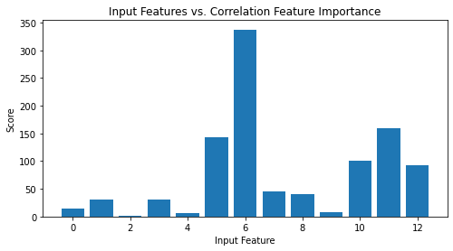
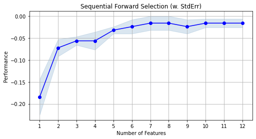
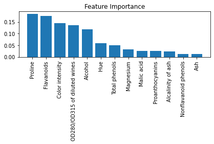

# Feature Selection for Wine Classification
Data science project example using feature selection methods and building classification models.

## Overview
In this project I built classification models for predicting wine classes applying various methods of feature selection. Dimensionality reduction via feature selection allows reducing the complexity of the model and avoiding overfitting. Via feature selection we select a subset of the original features, or we can apply regularization techniques.

## Resources Used
- Python 3.7
- NumPy and Pandas for data manipulation
- Matplotlib for data visualization
- sklearn for feature selection and building the classification models

## Dataset
The Wine dataset contains 13 distinctive features describing the chemical properties of the 178 wine examples. The examples 
belong to one of three different classes, 1, 2, and 3 which refer to the three different types of grapes grown in the same 
region in Italy but derived from different wine cultivars. 

## Feature Selection and Building Logistic Regression models
I used filter and wrapper methods to select a subset of the original features which are good predictors of the target. I also applied L1 and L2 regularizations as penalties against model complexity.
For each method applied, I built and evaluated a logistic regression model. For each model it was determined the training and test accuracy, the intercept, and coefficients.

Below are some plots showing the top features selected by different techniques.

 

 

## Feature Importance with Random Forest
Another approach that I used for selecting relevant features was using a random forest model and measuring the feature importance. 

The plot shows the relative importance values of the features in the wine dataset determined after fitting a random forest classifier.

 

We observe that two of the top-ranked features in the plot are also in the 5-features subset selection from correlation statistics and forward selection (Proline and Flavanoids).
